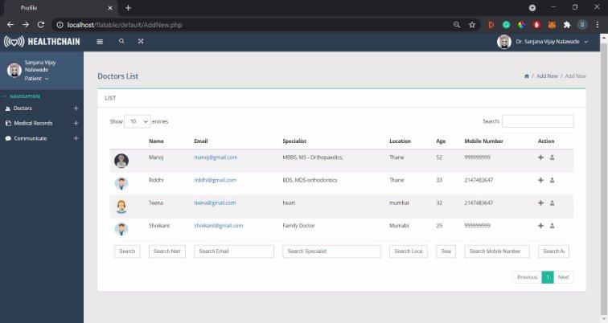

A Project Report on

###Healthchain : An Electronic Health Profile Storage Using Blockchain

###Contents

<!-- TABLE OF CONTENTS -->

  
Table of Contents

  <ol>
    <li><a href="#Introduction"> Introduction </a></li>
<ul>
<li><a href="#Problem-Definition"> Problem Definition </a></li>
<li><a href="#Objectives"> Objectives </a></li>
</ul>
<li><a href="#Literature-Review"> Literature Review </a></li>
<ul>
<li><a href="#Rationale"> Rationale and Gap Analysis</a></li>
<li><a href="#EXISTING"> EXISTING SYSTEM </a></li>
<ul>
<li><a href="#Electronic"> Electronic Health Record Systems </a></li>
<li><a href="#Practo"> Practo </a></li>
</ul>
</ul>
<li><a href="#Proposed"> Proposed System Architecture </a></li>
<ul>
<li><a href="#Methodology"> Methodology </a></li>
<li><a href="#Prototype"> Prototype</a></li>
<ul>
<li><a href="#Patient"> Patient </a></li>
<li><a href="#Doctor"> Doctor </a></li>
<li><a href="#Labs"> Labs </a></li>
<li><a href="#Insurer"> Insurer </a></li>
<li><a href="#Pharmaceutical"> Pharmaceutical Companies </a></li>
<li><a href="#Expected"> Expected Outcomes </a></li>
</ul>
</ul>
<li><a href="#Design"> Design </a></li>

<li><a href="#Project"> Project Implementation </a></li>

<li><a href="#Testing"> Testing </a></li>
<li><a href="#Result"> Result</a></li>
<li><a href="#Benefits"> Benefits to the Society </a></li>

<li><a href="#Conclusions"> Conclusions and Future Scope </a></li>
<ul>
<li><a href="#Conclusions"> Limitation </a></li>
<li><a href="#Conclusions"> Future Scope </a></li>
<li><a href="#Conclusions"> Conclusion </a></li>
</ul>
  </ol>

###List of Abbreviations

EHR: Electronic Healthcare Record
Healthchain: Healthcare Blockchain Network

<!-- Introduction -->

###Introduction

Blockchain technology has the potential to transform health care by placing the patient at the center of the health system and increasing the security, privacy, and interoperability of health data. This technology could provide a new model for health information exchange (HIE) by making electronic health records (EHRs) more ecient and secure. EHRs contain critical and highly sensitive private information for diagnosis and treatment in healthcare. These data are a valuable source of healthcare intelligence. The sharing of healthcare data is an essential step toward making the healthcare system smarter and improving the quality of healthcare service.

Here are ve basic principles underlying the technology.

1. Distributed Database: Each party on a blockchain has complete access to the database and its history. There is no single party in charge of the data or the information. Without the use of an intermediary, each party can independently verify the records of its transaction partners.
1. Peer-to-Peer Transmission: Communication takes place between peers rather than through a central node. Each node stores and transmits data to all other nodes.
1. Transparency with Pseudonymity: Any user who has access to the system can see every transaction and its associated value. Each node, or user, on a blockchain is identied by a unique 30-plus-character alphanumeric address. Users have the option of remaining anonymous or providing proof of their identity to others. Transactions take place between addresses on the blockchain.
1. Irreversibility of Records: Once a transaction is entered into the database and the accounts are updated, the records cannot be changed because they are linked to every previous transaction record (hence the term "chain"). Various computational algo- rithms and approaches are used to ensure that the database recording is permanent, chronologically ordered, and accessible to everyone on the network.
1. Logic Computation: Due to the ledger's digital nature, blockchain transactions can be linked to computational logic and thus programmed. As a result, users can program algorithms and rules to automatically initiate transactions between nodes.

<!-- Problem -->

### Problem Denition

Hospitals keep patient data in their database; similarly, lab reports are kept in the labora- tories database, and medical bills are kept in the pharmacies database. All of this dispersed data makes it dicult for the patient to maintain, store, and verify insurance claims. Fur- thermore, hospitals are sometimes hesitant to share data with patients or other doctors from other hospitals; there is a lack of transparency in the traditional system, and there is a need for centralization and communication among the various entities. Patient data is redundant on various organisations' individual databases, and the security of this data is jeopardised if the database experiences errors. The ow of communication between patients and doctors is an essential component of medical treatment. We all felt the need for digitalization during the covid situation, from online appointment booking to video call scheduling.

<!-- Objectives -->

### Objectives
- Collaboration Among Healthcare Organizations: It is made possible by providing the healthcare industry with a single, standardised, and consistent database of real-time patients secured with blockchain.
- Safe Data Exchanges: Blockchain protects data while also providing comprehensive data sharing options, allowing patients to unlock only the data required by their health- care providers while keeping the rest private and secure.
- Valuable Insights for Better Care: Every day, a massive amount of health data is created; it can be a tedious task for patients to keep this data physically, as well as for doctors to go through this vast data every time, which can lead to missing important data in the process.
- Complete healthcare services, including appointment scheduling, video calling, and electronic health record storage.

<!-- Literature-Review -->

###Literature Review

<!-- Rationale -->

###Rationale and Gap Analysis

Blockchain technology has the potential to signicantly change the healthcare system by putting the patient at the center of the system and increasing the protection, privacy, and interoperability of health data. This technology could provide a new model for Electronic Health Records (EHR) by making them more eective and safer. [9]

EHRs were not designed to deal with multi-organizational, long-term medical records. Pa- tients must retain the records, which is inconvenient given their medical conditions.[1] As a result, they disperse data around dierent organizations, and they change providers, result- ing in the loss of previous data, which is critical for studying the latest medical situation. Furthermore, the patient does not have full access to all records and interacts with them in a fragmented manner.[1]

Data sharing is hampered by a lack of structured communication among various providers and hospitals. As a consequence, data becomes scattered rather than coherent. Data re- trieval and sharing are dicult for both clinicians and patients. [10] We have put the patient rst at Healthchain. The integrated, clear image of medical history helps patients. This aids in the creation of trust and involvement in medical systems, as patients who are concerned about the condentiality of their records, may avoid using such applications or seek treat- ment online.

Patients are willing to manage their medical data on the internet in the age of online trans- actions and social media.[9] The patient's medical history is also essential for the study. Clinical trials, surveys, and teaching hospitals all provide data for the study. The patient's real-time medical data will assist in the gathering of more data for study and the provision of better treatment to others.

Because the patient is at the heart of the Healthchain application, he or she has primary access to the records.[9] Patients cannot modify or append data to the blockchain; how- ever, they can grant providers time-limited access. Because this data is appended to the blockchain as transactions, it is secure because blockchain is decentralized and secure. As a healthcare system, Healthchain also oers a list of nearby doctors or specialists, nearby pharmacies and labs, and online appointment booking. On the portal, you can also schedule online video appointment sessions. Doctors share the unique link to join the patient's session in order to avoid unscheduled calls to doctors.

Health tokens are used to pay for doctor's visits, lab fees, and pharmacy bills. Pharmaceutical companies conducting research can request patient data in exchange for token patient data

such as allergies, previous medications, and treatments restored in a discrete format through- out the patient's medical history. Going through and analyzing such a large amount of data can be time-consuming for the doctor. Healthchain analyses medical data and presents it in tables that highlight keywords from all patients' records. The patient's blood pressure and diabetic reports are graphically represented to help understand the changes over time.

<!-- Existing -->

###EXISTING SYSTEM
<!-- Electronic -->

### Electronic Health Record Systems

EHR is a record of the care you receive from your doctors or medical facilities. [9] It is created and maintained by health care providers and contains information about health issues, medications, and treatments. If you visit a lot of doctors, you might have a lot of EHR. The patient's data is stored in the cloud or on the local databases of various organisations by EHR systems. Its goal is to convert paper-based medical records into electronic medical records.[16] The data could be stored in an encrypted format or not. Some of this information is available to the patient, whereas others may be restricted to the organisation and cannot be shared.

<!-- Practo -->

### Practo

An app that can be used to get health checks done right away at the nearest pathology, connect with doctors in your area, and book an online appointment.[18] Practo is an online tool designed to assist doctors, labs, and hospitals in managing patient data. It also assists patients by sending them digital reminders about doctor's appointments. It oers two por- tals: practo ray and practo.com. The former is a doctor management software for doctors that requires a monthly subscription, while the latter is a consumer portal that is free for both patients and doctors.[18]

<!-- Proposed -->

### Proposed System Architecture
<!-- Methadology -->

###Methodology
- Helathchain is a healthcare system that oers a variety of services, such as viewing doc- tor proles, scheduling online appointments, scheduling health checkups in the nearest pathology lab, paying medical bills, and verifying these records for insurance claims, all in one place. Health tokens are used for transactions on the portal, and we can buy and redeem them.

Figure 3.1: System Architecture

- The patient is the most important entity in the healthchain, and patients have granular access to the EHR. They can allow medical practitioners to view or add data to their prole, which is then added to the blockchain.

Figure 3.2: Patient Controlled Access

- Healthchain stored medical data containing the patient's medical history is critical for diagnosis. Helathchain analyses this data and provides key highlights as well as graphs for better understanding. Data is also collected from wearable IoT devices such as tness bands, and applications that track step counts are displayed to help patients understand their progress.
<!-- Prototype -->

###Prototype

The ow of various entities is explained below

<!-- Patient -->

### Patient

Figure 3.3: Patient Flow

- User logins into the portal
- If incorrect credentials, the user needs to proceed with the forgotten password
- Else, the user is directed to Dashboard, where the user can add Doctors to the prole by sending them a request, booked an appointment, and also join the appointments on doctors initialization.
- On the Dashboard, the user can also view the appointments schedule, Medical Data consists of pending approvals for prescriptions, bills, reports, and approved bills.
- Tokens consist of the current user balance also the user can add new tokens if required
- Notications consist of notication regarding approval, appointments, etc

<!-- Doctor -->

### Doctor

Figure 3.4: Doctor Flow

- Doctors can view Patients' information like a list of patient's pro les can add a pre- scription to their prole, request tokens, and can also approve appointments and start the video or call appointments from the dashboard.
- On Dashboard, they can also view the appointment schedule
- Tokens consist of the current user balance also the user can redeem tokens if required
- Notications consist of notication regarding approval, appointments, etc
3. Labs
- Lab user can view the Patients list, can also add new patients, add new reports or bills, and can also request tokens from the dashboard
- Tokens consist of the current user balance also the user can redeem tokens.
- Notications consist of notication regarding approval, tokens, etc

Figure 3.5: Labs Flow

<!-- Insurer -->

### Insurer
- The insurer can view the Patients list and can also add new patients and view their proles, they can request access to the patients' data for approving the insurance and can also request tokens from the dashboard.
- Tokens consist of the current user balance also the user can redeem.

Figure 3.6: Insurance Flow

- Notications consist of notication regarding approval, tokens, etc
<!-- Pharmaceutical -->

### Pharmaceutical Companies
- Company users can view the Patients list and can also add new patients and view their proles, they can request access to the patients' data for research and can also send tokens for the same from the dashboard.
- Tokens consist of the current user balance also the user can redeem.

Figure 3.7: Pharmacecutical Companies Flow

- Notications consist of notication regarding approval, tokens, etc
6. Expected Outcome/s
- Helathchain in the form of a web application will provide ease to the healthcare providers and patients since it will be a one-stop location for all the records and ap- pointment booking, scheduling.
- Healthchain also makes it easy for the healthcare providers to collaborate, example Doctor A can easily read Doctor B's prescription from the patients' medical history record and can proceed with diagnosis much quickly.
- Data being present at Healthchain also helps Insurance companies to verify the bills and records easily.
- Data losses and redundancy will be minimized, as it is a centralized system that can be used at hospitals, clinics, and labs.
- Security Issue and data tampering with the medical records is minimized since the granular access to the data lies with the patients and only with the access from the patient the healthcare providers can add the data on the blockchain in an encrypted format.
- Data analysis on the patients' medical records which are of utmost importance to understand a patient's medical history, will help the healthcare providers with better insights which in turn will help for better diagnosis.

<!-- Design -->

###Design

4.1 Use Case Diagram

Figure 4.1: Test Cases

In the above gure Healthcare providers and patients use case diagram is shown. We can see that the healthcare provider can view or add data not directly to blockchain, they need access from the patient. The data is rst added to a temp database in mysql after approval prom the patient the data is added to blockchain where it is immutable.

<!-- Project -->

###Project Implementation

5.0.1 Program

The smart contract code for uploading document data to the Blockchain Network is shown below. This action can only be performed by the Admin of the Helathchain Account.

Figure 5.1: Smart Contract

Several important libraries have been added, and database connectivity has been estab- lished in the backend.

11

Figure 5.2: Establishing Connection

The parameters required for the Blockchain connection have been set, and an ABI le has been dened.

Figure 5.3: Blockchain Parameters dening

12

The code below demonstrates how data is extracted from a temporal database and sent to a blockchain network, as well as how the database is deleted with subsequent records.

Figure 5.4: Uploading the Document to the Blockchain Network

Transactions are signed before being sent to the blockchain network, and they include the following parameters.

Figure 5.5: Sign Transactions before adding to Blockchain The code below demonstrates how the data is obtained from the blockchain.

Figure 5.6: Fetch data from blockchain network

<!-- Testing -->

###Testing

The following test cases were carried out on the project in order to assess its performance and eciency. The test also assisted us in determining the correct operation of the solidity code.

Figure 6.1: Test Cases

Result

The following images are the results/output screenshots of our nished application: "HEALTHCHAIN "

Figure 7.1: Sign In

Figure 7.2: Patient Prole

Figure 7.3: Doctor Prole

Figure 7.4: Sending connection request

Figure 7.5: Adding and Viewing Prescription view

Figure 7.6: Prescription Form

Figure 7.7: Approving Request to View Data

Figure 7.8: Approving to add to blockchain

Figure 7.9: Prescription Data

Figure 7.10: Diabetes Graph

Figure 7.11: Blood Pressure Graph

Figure 7.12: Video Calling

<!-- Benefits -->

###Benefits to the Society

Helathchain benets society in the following ways:

- Because it is entirely online, it can be accessed at any time and from any location.
- Medical data is stored on the blockchain, which reduces the use of paper, which is susceptible to damage over time. In addition, digital storage makes it easier to access, search, and append data.
- Blockchain has the advantage of not being controlled or owned by any entity, and because it is a decentralised system, transparency is maintained.
- Patients can concentrate on their recovery rather than the hassle of managing, trans- porting, and storing medical data.
- During appointments, patients may forget to convey a medical history that could have assisted the doctor in making a better diagnosis; this is overcome by using healthchain, which provides valuable insights to the patients' medical history.
- The inability of EHR and health IT systems to share health data is their most signi - cant challenge. This interoperability challenge is addressed by blockchain technology, which uses common technical standards to securely distribute electronic health data.
- The challenges of result shifting and data snooping are addressed by blockchain tech- nology. The system allows for the transfer of time-stamped permanent records of clinical trials and research outcomes, reducing the occurrences of fraud and error in clinical test records.
- The medical record is the most comprehensive record of a person's identication and must be handled with care. Blockchain technology has proven to be extremely eective in ensuring the integrity and security of medical records. Because blockchain-encrypted data cannot be changed or deleted.

<!-- Conclusions -->

###Conclusions and Future Scope

1. Limitation
- Scalability: Depending on their functionality, healthcare providers have different roles, such as doctors, physicians, nurses, clinicians, and so on. To accommodate these scenarios, the current Healthchain system must be expanded.
- In real-time applications, network latency is a critical issue. Data generated by wear- able devices is high in volume and also very fast, resulting in a large amount of trac on the server. A lightweight blockchain design would be the solution to optimise data processing and transaction communication.
2. Future Scope
- In the future, we intend to learn more about a better payment system; currently, tokens are used, but a better module for the same item can be developed.
- Machine learning and automation can be applied to medical data to predict patients' health problems in real time. It will assist healthcare providers in providing more ecient and immediate healthcare services.
- Healthchain is a simple blockchain-based application for EHRs that meets some basic requirements. More functionalities and roles, as well as more extensive testing, are required for it to be used by a hospital network.
- Before large-scale production deployments, more research will be needed to determine the scalability, security, and cost-eectiveness of blockchain technology.
3. Conclusion

In this project, Healthchain is proposed as an online healthcare framework that provides a complete solution for electronic health records and service management. The blockchain framework for EHR management is intended to give patients ownership and control over their EHRs. Patients can securely control access to documents and track how records are used, as well as allow secure record transfer and reduce the ability of unauthorised actors. It aims to solve the current digital problems in the healthcare sector by providing centralization, security, and features such as video calls, making Healthchain the one-stop application for all your health documents and services.

###Bibliography

1. Cristiano Andre da Costa Andre Henrique Mayer. Electronic health records in a Blockchain: A systematic review - Andre Henrique Mayer, Cristiano Andre da Costa, Rodrigo da Rosa Righi, 2020. url: https://journals.sagepub.com/doi/full/10.1177/ 1460458219866350.
1. Suveen Angraal, Harlan M. Krumholz, and Wade L. Schulz. \Blockchain Technology". In: Circulation: Cardiovascular Quality and Outcomes 10.9 (2017), e003800. doi: 10. 1161/CIRCOUTCOMES.117.003800. url: https://www.ahajournals.org/doi/abs/ 10.1161/CIRCOUTCOMES.117.003800.
1. Gaby G. Dagher et al. \Ancile: Privacy-preserving framework for access control and in- teroperability of electronic health records using blockchain technology". In: Sustainable Cities and Society 39 (2018), pp. 283{297. issn: 2210-6707. doi: https://doi.org/ 10.1016/j.scs.2018.02.014. url: https://www.sciencedirect.com/science/ article/pii/S2210670717310685.
1. T. K. Dasaklis, F. Casino, and C. Patsakis. \Blockchain Meets Smart Health: To- wards Next Generation Healthcare Services". In: 2018 9th International Conference on Information, Intelligence, Systems and Applications (IISA). 2018, pp. 1{8. doi: 10.1109/IISA.2018.8633601.
1. H. Guo et al. \Access Control for Electronic Health Records with Hybrid Blockchain- Edge Architecture". In: 2019 IEEE International Conference on Blockchain (Blockchain). 2019, pp. 44{51. doi: 10.1109/Blockchain.2019.00015.
1. Kenneth D Mandl et al. \Public standards and patients' control: how to keep electronic medical records accessible but privateMedical information: access and privacyDoctrines for developing electronic medical recordsDesirable characteristics of electronic medical recordsChalleng..." In: BMJ 322.7281 (2001), pp. 283{287. issn: 0959-8138. doi: 10. 1136/bmj.322.7281.283. eprint: https://www.bmj.com/content/322/7281/283. full.pdf. url: https://www.bmj.com/content/322/7281/283.
1. Andre Henrique Mayer, Cristiano Andre da Costa, and Rodrigo da Rosa Righi. \Elec- tronic health records in a Blockchain: A systematic review". In: Health Informatics Journal 26.2 (2020). PMID: 31566472, pp. 1273{1288. doi: 10.1177/1460458219866350. eprint: https://doi.org/10.1177/1460458219866350. url: https://doi.org/10. 1177/1460458219866350.
1. Dinh C. Nguyen et al. \Blockchain for Secure EHRs Sharing of Mobile Cloud Based E- Health Systems". In: IEEE Access 7 (2019), pp. 66792{66806. doi: 10.1109/access. 2019.2917555.
1. K. Rabah. \Challenges Opportunities for Blockchain Powered Healthcare Systems: A Review". In: (2017).
10. A. Shahnaz, U. Qamar, and A. Khalid. \Using Blockchain for Electronic Health Records". In: IEEE Access 7 (2019), pp. 147782{147795. doi: 10.1109/ACCESS.2019.2946373.
10. Ravi Sharma et al. Design of Blockchain-based Precision Health-Care Using Soft Sys- tems Methodology. Dec. 2019. url: https://www.emerald.com/insight/content/ doi/10.1108/IMDS-07-2019-0401/full/html.
10. Sudeep Tanwar, Karan Parekh, and Richard Evans. \Blockchain-based electronic health- care record system for healthcare 4.0 applications". In: Journal of Information Security and Applications 50 (2020), p. 102407. issn: 2214-2126. doi: https://doi.org/10. 1016/j.jisa.2019.102407. url: https://www.sciencedirect.com/science/ article/pii/S2214212619306155.
10. Dara Tith et al. Application of Blockchain to Maintaining Patient Records in Elec- tronic Health Record for Enhanced Privacy, Scalability, and Availability. Jan. 2020. url: https://www.ncbi.nlm.nih.gov/pmc/articles/PMC7010942/.
10. J. Vora et al. \BHEEM: A Blockchain-Based Framework for Securing Electronic Health Records". In: 2018 IEEE Globecom Workshops (GC Wkshps). 2018, pp. 1{6. doi: 10.1109/GLOCOMW.2018.8644088.
10. X. YANG et al. \Blockchain-Based Secure and Searchable EHR Sharing Scheme". In: 2019 4th International Conference on Mechanical, Control and Computer Engineering (ICMCCE). 2019, pp. 822{8223. doi: 10.1109/ICMCCE48743.2019.00188.
10. G. Zyskind, O. Nathan, and A. '. Pentland. \Decentralizing Privacy: Using Blockchain

to Protect Personal Data". In: 2015 IEEE Security and Privacy Workshops. 2015, pp. 180{184. doi: 10.1109/SPW.2015.27.

###Acknowledgement

We have great pleasure in presenting the report on Healthchain -An Electronic Health Prole Storage Using Blockchain We take this opportunity to express our sin- cere thanks towards our guide Prof. Kiran Deshpande Department of IT, APSIT thane for providing the technical guidelines and suggestions regarding line of work. We would like to express our gratitude towards his constant encouragement, support and guidance through the development of project.

We thank Prof. Kiran B. Deshpande Head of Department,IT, APSIT for his encour- agement during progress meeting and providing guidelines to write this report.

We thank Prof. Vishal S. Badgujar BE project co-ordinator, Department of IT, APSIT for being encouraging throughout the course and for guidance.

We also thank the entire sta of APSIT for their invaluable help rendered during the course of this work. We wish to express our deep gratitude towards all our colleagues of APSIT for their encouragement.

Sanjana Nalawade : 17104056:

Sitanshu Mathukia : 18204004 :

Kunal Jadhav : 17104026 :

